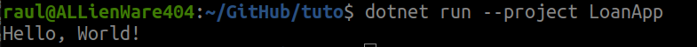

# Functional DotNet Tutorial

Esse é um pequeno tutorial sobre interoperabilidade entre F# e C# no ambiente .net.

A ideia é produzir uma aplicação simples que integra uma biblioteca escrita em linguagem funcional (F#) com uma aplicação escrita em C#.

Isso permite isolar os efeitos colaterais no lado do C# e manter as funções puras do lado do F#.

O primeiro passo é preparar todo o ambiente para começar a escrever a aplicação.

## Preparação

Instalar o .net SDK (preferencialmente no WSL):

```shell
sudo add-apt-repository ppa:dotnet/backports
sudo apt-get update && \
  sudo apt-get install -y dotnet-sdk-9.0
```

- Criar um repositório no GitHub e rodar:

```shell
dotnet new sln -n LoanService
dotnet new classlib -lang F# -o LoanRules
dotnet new console -lang C# -o LoanApp

dotnet sln add LoanRules/LoanRules.fsproj
dotnet sln add LoanApp/LoanApp.csproj
dotnet add LoanApp/LoanApp.csproj reference LoanRules/LoanRules.fsproj
```

Isso irá criar uma `Solution` na raiz do repositório com dois projetos:
- LoanApp: um `Console Application` em C#
- LoanRules: uma `Lib` em F#

Em ambos os casos, os projetos são previamente preenchidos com código de exemplo.

## Testando a solução

```shell
dotnet run --project LoanApp
```

Deve aparecer algo:



Esse é o programa padrão quando criado um programa do tipo `Console Application`.

Nas próxima etapa vamos integrar a biblioteca com o programa em C#.
